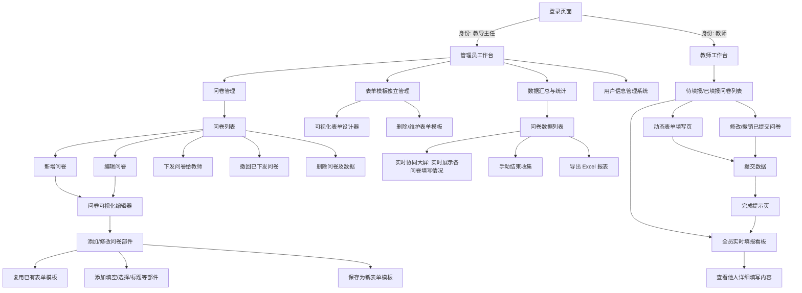
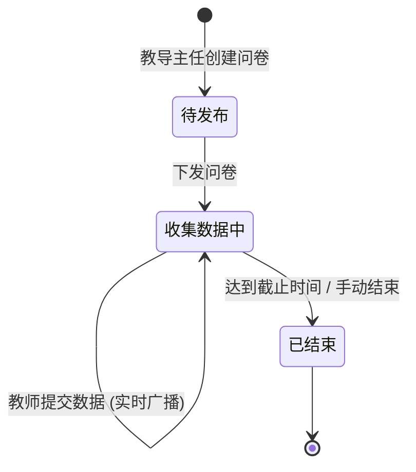

# 产品需求文档 (PRD)

## 1. 目的
明确初中集中调研报告系统的业务目标、核心用户角色、详细功能边界以及系统的非功能性需求，为后续的架构设计与开发提供准则。

## 2. 内容

### 2.1 项目概述
- **系统背景**：在初中教育场景中，教导处经常需要向全校教师下发各类调研问卷（如车辆登记、教学进度反馈等）。传统的收集方式效率低下且难以统计，且往往缺乏信息透明度。
- **业务目标**：构建一个集中调研报告系统，实现问卷的灵活下发、便捷填写与自动汇总，并支持全员实时查看填写进度与内容，促进信息共享。
- **解决的核心问题**：通过“元数据驱动 + JSON混合存储”的动态表单架构，解决传统关系型数据库在应对多变问卷结构时频繁修改表结构（DDL）的痛点，实现真正的动态问卷。

### 2.2 用户角色
- **管理员（教导主任）**：拥有全局最高权限。负责创建问卷、维护表单模板、可视化定义问卷部件（表单、标题等）、定向下发问卷，以及查看、导出所有汇总数据。
- **表单填写员（教师）**：基础权限用户。负责接收定向问卷并进行数据填报。其基础信息（如序号、姓名、学科）由系统锁定，不可篡改。**同时拥有数据查看权限，可实时查看该问卷下所有其他教师的填报内容与进度，实现信息的公开透明。**
- **数据查看员（可选/未来扩展）**：特定维度的管理者（如年级组长、教研组长），仅能查看特定学科或年级的统计数据。

### 2.3 功能清单
1. **问卷与表单设计器模块**：
   - 问卷可视化构建：支持在问卷中添加表单部件及其他基础部件（标题、说明、填空、选择等）。
   - 表单模板管理：支持将常用表单保存为模板，支持在问卷中复用已有表单模板。
   - 问卷生命周期管理：支持问卷的创建、编辑、下发、撤回、手动结束收集与删除（级联删除所有已填数据）。
2. **数据填报与查看模块**：
   - 定向推送与通知：管理员发布后，对应教师列表可见该问卷。
   - 动态问卷渲染：前端根据后台配置的问卷结构（包含 JSON Schema 表单）动态生成填报页面。
   - 基础信息锁定：教师填报时，其姓名、学科、序号自动填充且只读。
   - 填写体验优化：提交后自动反馈状态，支持实时协同编辑模式下的数据同步。
   - 提交限制与回显修改：限制单人针对同一问卷仅能提交一次，提供数据回显功能，并支持在允许的时间窗口内修改或撤销已提交的数据。
   - **全员实时看板**：教师端集成实时数据看板，可查看当前问卷的所有已提交数据（包括他人填写的内容），支持按学科筛选或搜索，数据通过 WebSocket 实时刷新。
3. **数据查询与展示模块**：
   - 动态数据表格：后台根据填报结果，动态拼接固定列与动态 JSON 列，生成完整数据表。
   - 实时大屏协同：基于 WebSocket 实现管理端与教师端实时刷新最新提交的数据。
   - 统计与图表：支持按学科、按选项等维度生成基础柱状图、饼图进行数据汇总。
   - 数据导出：支持一键导出包含身份信息与业务数据的完整 Excel 报表。
4. **用户管理模块**：
   - 用户信息管理系统：管理端提供教师信息（如工号、姓名、学科、角色等）的增删改查及批量导入功能。
5. **权限管理模块**：
   - 基于角色的访问控制（RBAC），区分 Admin 与普通 User 的操作边界（如 Admin 可管理问卷，User 仅可填报与查看）。

### 2.4 界面交互与状态流程

#### 界面交互流程图 (UI Flow)

#### 表单数据状态图 (State Diagram)

### 2.5 非功能需求
- **性能需求**：系统需支持至少 1000 份问卷并发在线；单次问卷下发后，支持全校教师（约 200-500 人）在 10 分钟内集中提交与**并发实时查看**，接口响应时间 < 500ms。WebSocket 服务需支持高并发广播，确保所有在线教师能实时看到新提交的数据。
- **安全性**：前后端分离，API 需鉴权（JWT）；动态 JSON 数据需防范 XSS 注入攻击。虽然数据全员可见，但需确保基础用户信息（如密码、手机号等敏感隐私）脱敏（注：当前需求侧重全员可见，暂不强制脱敏业务数据，但需保留脱敏能力）。
- **可扩展性**：后端存储采用“动静分离”模式，静态高频字段建立索引，动态低频字段存 JSON，既保证查询效率，又提供极强的业务扩展能力。
