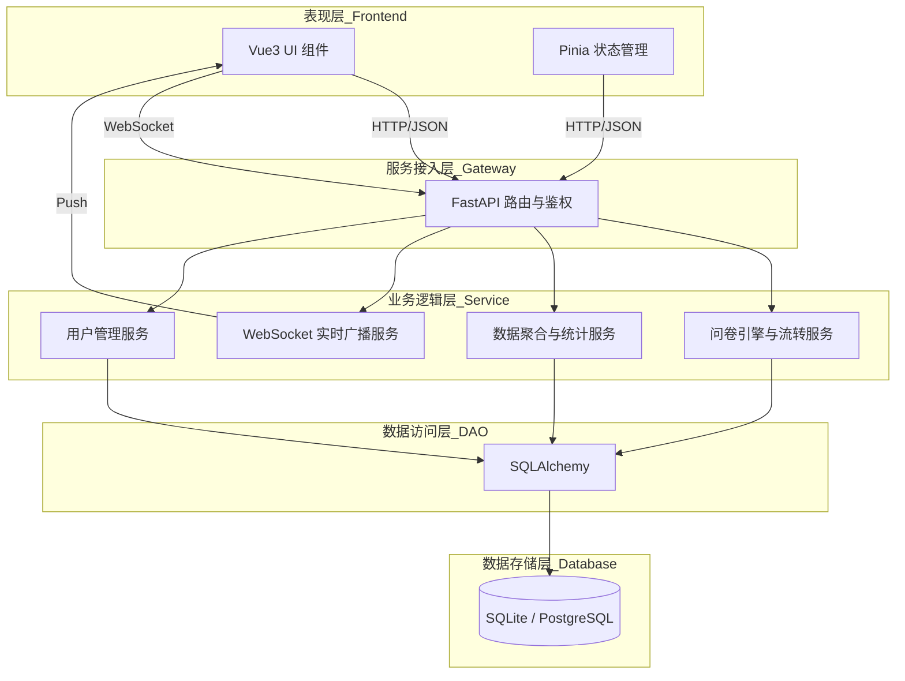
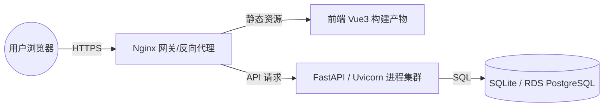

# 系统架构设计文档

## 1. 目的
定义集中调研报告系统的顶层技术架构、核心组件划分和技术栈选型，确保系统的高可用、可扩展与易维护性。

## 2. 内容

### 2.1 架构原则
- **动静分离**：将查询频率高、结构固定的基础字段（静态）与结构多变、查询频率低的业务字段（动态）分离存储。
- **元数据驱动**：系统的问卷展现和数据校验均由存储在数据库中的 JSON Schema（元数据）来动态驱动，代码逻辑不与具体问卷结构强耦合。
- **前后端分离**：采用 RESTful API 契约，前后端独立部署与迭代。

### 2.2 技术栈
- **后端框架**：Python 3.13 + FastAPI（提供高性能的异步 API 支持）
- **持久层**：SQLAlchemy (ORM)
- **数据库**：SQLite（初期开发与轻量部署），生产环境随时可无缝切换至 PostgreSQL（支持更强大的原生 JSONB 查询与索引）。
- **前端框架**：Vue 3 + Vite + Ant Design Vue + Axios。

### 2.3 逻辑架构
- **表现层 (Frontend)**：Vue3 负责页面路由、状态管理（Pinia/Vuex），并通过 JSON Schema 动态渲染问卷 UI (SurveyEngine)。
- **服务接入层 (API Gateway/Controller)**：FastAPI 提供路由分发、JWT 鉴权、请求限流与入参校验。
- **业务逻辑层 (Service)**：处理问卷元数据解析、JSON 拼装、下发与撤回状态流转、数据聚合逻辑。
- **数据访问层 (DAO/ORM)**：通过 SQLAlchemy 将业务模型映射为 SQL 语句，处理与数据库的交互。
- **数据存储层 (Database)**：关系型数据库（SQLite/PostgreSQL）混合 JSON 列存储。

#### 逻辑架构图



#### 核心业务流程 (Flowchart)

```mermaid
graph TD
    subgraph Admin[管理员: 问卷管理]
        A[开始] --> B{新建问卷?}
        B -- 是 --> C[输入问卷名称]
        C --> D[可视化定义问卷 JSON Schema]
        D --> E[保存问卷 (草稿)]
        E --> F[下发问卷给教师]
        F --> F2[状态变为已下发]
    end

    subgraph User[用户: 数据录入与查看]
        G[查看待办任务] --> H[前端请求问卷元数据]
        H --> I[动态渲染问卷 UI]
        I --> J[填写业务数据]
        J --> K[提交数据]
        K --> L[后端校验 & 存储答卷 JSON]
        L --> Broadcast[WebSocket 实时广播]
        I --> ViewBoard[查看全员实时看板]
    end

    subgraph System[系统: 数据管理]
        Broadcast -->|Push Event| RealTimeUI[管理端大屏/教师端看板刷新]
        M[查询问卷数据] --> N[获取所有答卷]
        N --> O[解析 JSON 动态字段]
        O --> P[合并静态字段]
        P --> Q[渲染动态表格]
        Q --> R[收回/截止问卷]
    end

    F2 --> G
    L --> M
```

### 2.4 部署架构
- **前端部署**：静态资源由 Nginx 代理分发，提供反向代理解决跨域问题。
- **后端部署**：使用 Uvicorn/Gunicorn 启动多 Worker 进程提供 ASGI 服务。
- **数据库部署**：单机部署 SQLite 文件；若切换至云环境，推荐使用托管的 RDS PostgreSQL 集群，实现读写分离。
- **网络与负载**：Nginx 充当统一的 API 网关与负载均衡器。

#### 部署架构图


